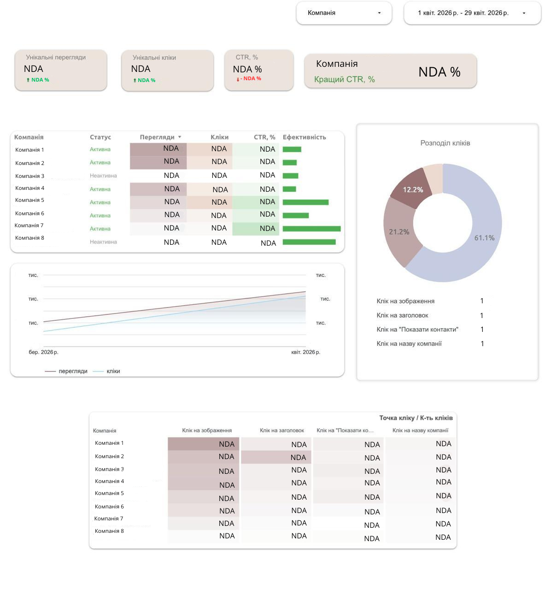

# Business Card Metrics ETL & Visualization Pipeline

## 📌 Project Overview
This project demonstrates a complete end-to-end data engineering and analytics workflow. It automates the extraction of business card performance metrics (views, clicks, and specific user interactions) from a high-load **ClickHouse** cluster, enriches this data with metadata from **MySQL**, and synchronizes it with **PostgreSQL** for final reporting.

The ultimate goal of this pipeline is to power a strategic dashboard in **Looker**, providing actionable insights into how users interact with company business cards on the marketplace.

---

## 🛠 Tech Stack
*   **Data Extraction:** SQL (ClickHouse)
*   **ETL Orchestration:** Python (Pandas, SQL-Alchemy)
*   **Metadata Source:** MySQL
*   **Data Warehouse:** PostgreSQL
*   **Visualization:** Looker (Google Looker Studio)
*   **Automation:** Scheduled via Cron (daily execution at 10:05 AM)

---

## 🏗 Pipeline Architecture

### 1. Extraction (ClickHouse)
I developed an optimized SQL query that aggregates raw event data. It uses `countIf` and `uniqExactIf` to calculate:
*   **Total Views:** Every time a business card is displayed.
*   **Unique Interactions:** Based on `web_id` to filter out bot traffic or repetitive actions.
*   **Click Segmentation:** Mapping specific event IDs to human-readable actions like "Click on image", "Show contacts", or "Click on title".

### 2. Enrichment (Data Join)
Since event logs only contain IDs, the Python script fetches company names and categories from the **MySQL** production replica. This "joins" the two worlds: raw traffic stats and business metadata.

### 3. Loading & Synchronization
Data is synchronized with a PostgreSQL metrics table. The script includes a **validation step** to check for existing data before insertion, preventing duplicates and ensuring data integrity for the dashboard.

---

## 📊 Looker Dashboard & Business Impact
The processed data is connected to a **Looker** dashboard, which provides:
*   **CTR Analysis:** Monitoring the conversion rate from views to contact reveals.
*   **Engagement Heatmap:** Identifying which elements of the business card (images vs. titles) drive the most traffic.
*   **Company Performance:** Allowing the sales team to provide data-backed reports to business clients about their visibility on the platform.

---

## 📂 Project Structure
*   `database/`: PostgreSQL schema definitions.
*   `sql/`: Aggregation queries for ClickHouse.
*   `helpers/`: Python utilities for MySQL data enrichment.
*   `scripts/`: Main ETL execution logic and synchronization scripts.

  ### 📊 Looker Dashboard Preview

